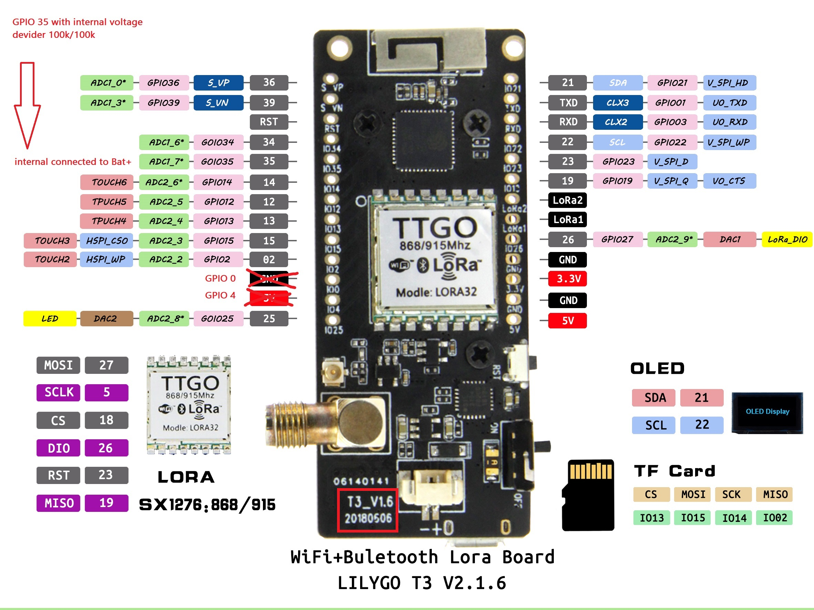

# Hardware

## Microcontroller 

The firmware has been developed and tested on a LILYGO T3 V2.1.6 LoRa32 microcontroller. Other boards can be targetted and I've successfully tested it with the Heltec WiFi LoRa 32(v2).

## Sensors

The firmware recognises sensors connected to the I2C bus.

## LoRa

The device communicates through any LoRaWAN gateway that is in range. This firmware has been tested using a [Laird Sentrius RG186](https://connectedthings.store/gb/lorawan-gateways/indoor-lorawan-gateways/laird-sentrius-rg186-lorawan-gateway.html).

