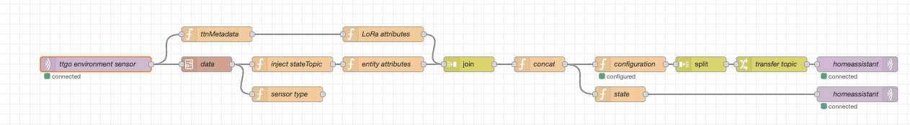

# Node-RED



To get the data into Home Assistant, a [Node-RED](https://nodered.org/) flow is provided that decodes the protocol buffer Packet and transmits its content as a set of MQTT topics.

The flow is defined in `lib/node-red/lora-sensor.json`, which you can import in your local instance of Noe-RED. For security reaons, I've omitted the MQTT in/out nodes because they require passwords.

It expects a protocol definition schema in `data/protobuf/packet.proto` in your Node-RED folder. This is provided in `lib/protobuf-packet/packet.proto`.

## Data in / out

The Things Network retransmits the protocal buffer packet emitted by the firmware over MQTT. Configure a Node-RED `MQTT in` node as follows and wire it to the inputs of the `data` and `ttnMetadata` nodes.

```    
connection
    server: eu1.cloud.thethings.network
    port: 1883
    protocol: MQTT V3.1.1
    session: use clean session

security
    username: (whatever you defined for your The Things Network application)
    password: (whatever you defined for your The Things Network application)

properties:
    server: (the one you defined in connection)
    action: subscribe to a single topic
    topic: v3/XXX@ttn/devices/YYY/up where XXX = your application name, YYY = the eui of your device in the application
    output: a parsed JSON object
```

Configure a Node-RED `MQTT out` node to point to your Home Assistant MQTT server and hook it up to the outputs of the `transfer topic` and `state` nodes.

## What's going on

The flow is using Home Assistant's [MQTT Discovery](https://www.home-assistant.io/docs/mqtt/discovery/) feature to automate configuration of the device. 

It dynamically generates discovery and state topics from the packet, requiring no additional configuration other than provision of the protocol definition schema. 

In the Node-RED flow, the `configuration` node generates the discovery topics for each entity attribute present in `Packet`. Node `state` transmits each packet as it arrives on its defined MQTT topic, with attribute data as the payload. 

Home Assistant `entity ID` and `Friendly Name` are generated from the `DEVICE_NAME` build flag and protocol buffer `EntityName` and `Attribute` fields.

A build flag sets the name of the sensor as it appears in Home Assistant (see [firmware](firmware.md)):

```
build_flags = 

    -D DEVICE_NAME=greenhouse
```

The entity and attribute names are as they are defined in the Protocol Buffer schema. So an attribute from a device with `DEVICE_NAME` "greenhouse", protocol buffer `EntityName` "SHT31" and protocol buffer `Attribute` "temperature" will appear with Home Assistant `Entity ID` as `sensor.greenhouse_temperature_sht31` and friendly name `Greenhouse temperature (SHT31)`.

